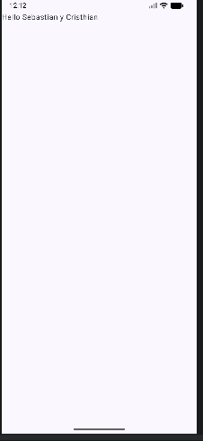

# Mobile1Project

## Descripción
Aplicación básica desarrollada en Kotlin utilizando Android Studio y Jetpack Compose. 
La aplicación muestra un saludo personalizado en pantalla.

## Funcionalidad
Al ejecutar la aplicación se muestra el mensaje:
Hello, Sebastián y Cristhian

## Estándar de Codificación
- Se utilizan nombres en inglés para variables, funciones y clases.
- Variables y funciones usan camelCase.
- Clases usan PascalCase.
- Se prefirió el uso de val sobre var cuando es posible.
- Las funciones tienen nombres descriptivos.
- El código se mantiene ordenado e indentado.
- Se agregan comentarios cuando es necesario.

## Evidencia

## Autor
Sebastián Nevárez y Cristhian Loya